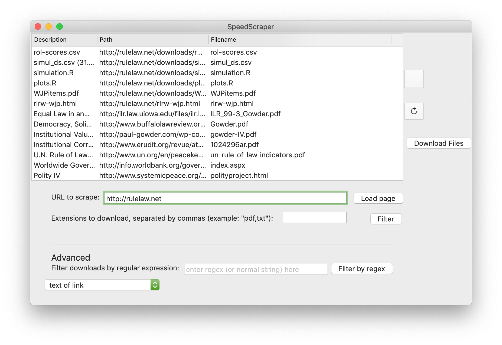
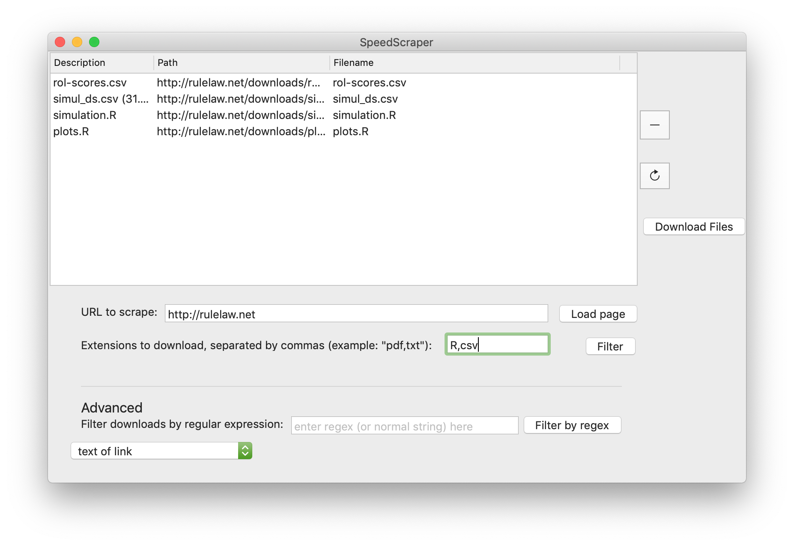
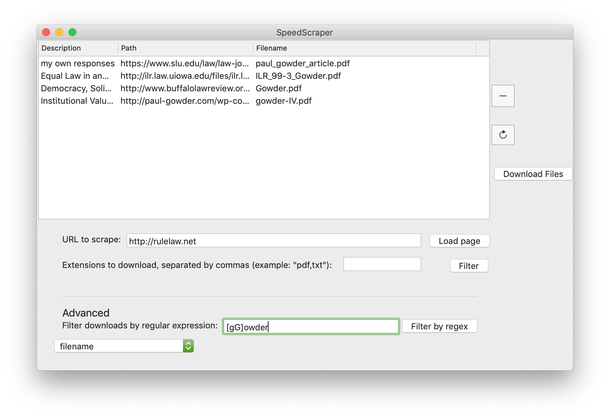

# speedScraper

## The Problem

There are a bunch of web pages that provide multiple files that one might want to download.  For example, a list of PDFs or zip files. (I'm looking at you, Humble Bundle books!  Also, every government website.) It's annoying and inconvenient to right-click them all individually and save them. Especially if you have browsers like Chrome that start to choke when you try to tell them to download like 50 files at once.

## The Solution

This app.  It pops up a GUI (MacOS, 10.12 and above) where you can enter a URL.  It loads that URL in a hidden webview (basically an instance of Safari in the background), and gives it three seconds, then it grabs every link. Then you can filter the list of links by file extension, or by a regular expression match across either entire url, filename, or link text (or just remove individual items). Then you can hit the download button and speedScraper will create a subfolder in your Downloads folder and download everything you've asked for into it.

## How to Get It

1.  Go to [the latest release](https://github.com/paultopia/speedScraper/releases/latest).

2.  Download it.

3.  Unzip the file. 

4.  Save it wherever you want.

5.  Control-click it and choose "open" to tell it it's ok to run unsigned apps.

6.  Profit!

## Good things

Even though duplicates may show up in the filter table, it's smart enough not to download duplicate links more than once.

By using a hidden webview and imposing a three-second delay, this app is able to capture many kinds of links loaded by javascript (e.g., in react single page applications, ajax-loaded content, etc.), as opposed to a python script or something which would just get the links from the html returned by the server. (Though no guarantees on this, as some sites probably check to make sure the page is viewable, or incrementally load links, or are just slower than 3 seconds, or whev.)

## Bugs and Possible Bugs and ToDos

- I don't know what happens if you let your computer go to sleep when this is downloading.

- Currently, trying to simultaneously apply the extension filter and a regex filter doesn't work.  Just one or the other. (Also, I'd like to add the capacity to have multiple regex filters later.)  If you get weird results, try hitting the refresh button to the right of the list. 

- Currently can't handle files where there isn't actually a filename in the url.  For example, a link that hits some endpoint like http://annoying.server/downloads?file=TheSecretStuff which returns a pdf won't actually get the link.  This app uses the filename in the URL to guess what's a downloadable thing and what isn't.  

- Currently haven't implemented (a) any menu items, (b) any way of selecting multiple rows at once in the table, (c) any keyboard anything other than hitting enter in the text fields.  On the road map.

- It doesn't have an application icon because I completely lack all artistic ability to make one.

- I don't want to give Apple money to join their developer program right now, so you will have to jump through some obnoxious hoops (control-click and open from the popup menu, then give the OS an admin password --- see details [at the bottom of this page](https://support.apple.com/en-us/HT202491)) to allow an app from an unsigned developer to run.

## Screenshots

Basic usage: 

File extension filter: 

Regex filter: 

